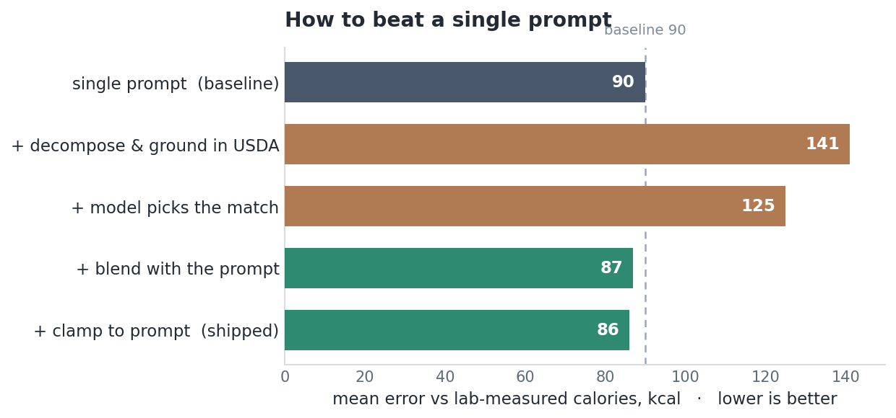
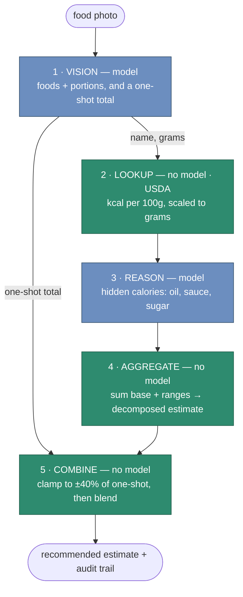
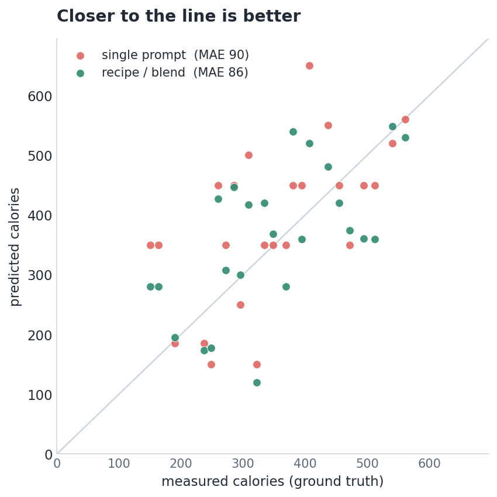
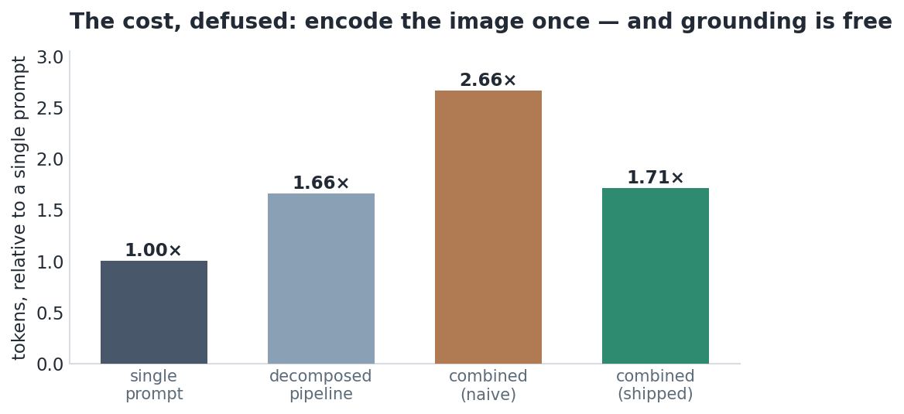

# calorie-pipeline

### How to (actually) beat a single prompt — a measured recipe

A worked, reproducible answer to a question every applied-AI engineer hits:
*you have a one-shot baseline; how do you reliably do better?* The task is
estimating calories from a food photo on local 7B models
([Ollama](https://ollama.com)) — but the recipe is the point, and it's backed by
an honest benchmark on **24 meals with lab-measured calories**
([Nutrition5k](https://github.com/google-research-datasets/Nutrition5k)), not
vibes. Runs entirely local on a single 16 GB GPU.

<p align="center">
  
</p>

## The recipe

Each step's effect, measured (mean abs error vs ground truth, kcal — lower is better):

| # | step | MAE |
|--:|---|--:|
| | single prompt (baseline) | 90 |
| 1 | + decompose & **ground** the facts in USDA | 141 &nbsp;← *worse alone* |
| 2 | + model **picks** the database match (judgment) | 125 |
| 3 | + keep the prompt, **blend** the two | 87 |
| 4 | + **clamp** the decomposition to the prompt | **86** &nbsp;← beats baseline |

**Don't replace your prompt — correct it.** A single prompt is a *strong* baseline
(it regresses to a sensible prior). "Just decompose it" **loses on its own** —
chaining estimates *multiplies* their errors. What wins:

1. **Ground** the one fact that has a right answer (cal/100 g) in a database, not
   the model — free accuracy, zero tokens, but not enough alone.
2. Use the model for **judgment** (which row matches this food), never arithmetic.
3. **Keep** the cheap prompt as an independent estimate.
4. **Blend** the two — their errors are weakly correlated (r = 0.29), so the
   average beats both — then **clamp** the decomposition to ±40% of the prompt so
   its blow-ups can't run away.

(And skip autonomy on a fixed-path task: an agentic self-correcting version cost
more and didn't help.)

Full write-up, with the four-version debugging trail and why decomposition loses
on its own: **[the blog post](blog/how-to-beat-a-single-prompt.md)** ·
**[`benchmark/results/summary.md`](benchmark/results/summary.md)**.

## Architecture



<sub>**Blue** = model judgment · **green** = deterministic code. Each arrow is a
typed dataclass contract (`Ingredient → GroundedIngredient → Adjustment →
Estimate`), so every stage boundary is printable, testable, and swappable. Two of
four stages — and the combine — use no model at all.</sub>

## Does it work?

24 lab-measured Nutrition5k dishes, `qwen2.5vl:7b` + `qwen2.5:7b`, vs ground truth:

<p align="center">
  
</p>

The single prompt (MAE 90) beats the decomposed pipeline *alone* (141) — it's
high-variance because errors compound. But the recipe's blend (**86**) beats the
prompt, and the decomposition stays *auditable* and fails loudly: on an
out-of-distribution bagel stack the one-shot returned **0**; the pipeline returned
a defensible, itemized 530.

### "But it uses more tokens"

<p align="center">
  
</p>

The image is the whole bill (~1,100 tok); text is rounding error. A *fused* vision
call returns the total **and** the breakdown in one pass
([`estimate_fused`](calorie_pipeline/pipeline.py)) — so the combined answer is
**~1.7×** a single prompt, not 2.7×, and the accuracy-driving USDA grounding costs
**zero tokens**.

## Quickstart

```bash
pip install -r requirements.txt
ollama pull qwen2.5vl:7b && ollama pull qwen2.5:7b
export OLLAMA_HOST=http://localhost:11434 FDC_API_KEY=DEMO_KEY   # DEMO_KEY works

python -m calorie_pipeline.run meal.jpg          # one photo, both methods + the recommended blend
```

```
ONE-SHOT BASELINE          250 kcal  (single point, no provenance)
DECOMPOSED PIPELINE        crust 140 + mozz 60 + sauce 10 + pepperoni 76  →  305–315 kcal
RECOMMENDED (blend)        ~300 kcal
```

## Reproduce & test

```bash
python benchmark/build_manifest.py 24 && python benchmark/run_benchmark.py   # the benchmark + chart
python benchmark/measure_tokens.py                                          # the token table
python -m unittest discover -s tests                                        # 59 offline tests, < 1s
```

```
calorie_pipeline/   config · models · vision · lookup · reason · pipeline · run
evals/              metrics + fixture harness (deterministic, no model/network)
benchmark/          Nutrition5k builder, runner, results/ (tables, charts, summary.md)
blog/               the full write-up
```

Config is centralized and env-overridable (`VISION_MODEL`, `TEXT_MODEL`,
`LLM_MATCH`, `COMBINE_WEIGHT`, …), so a bigger box swaps in larger models with zero
code changes.

## License

MIT. Nutrition5k © its authors (CC BY 4.0); USDA FoodData Central is public domain.
