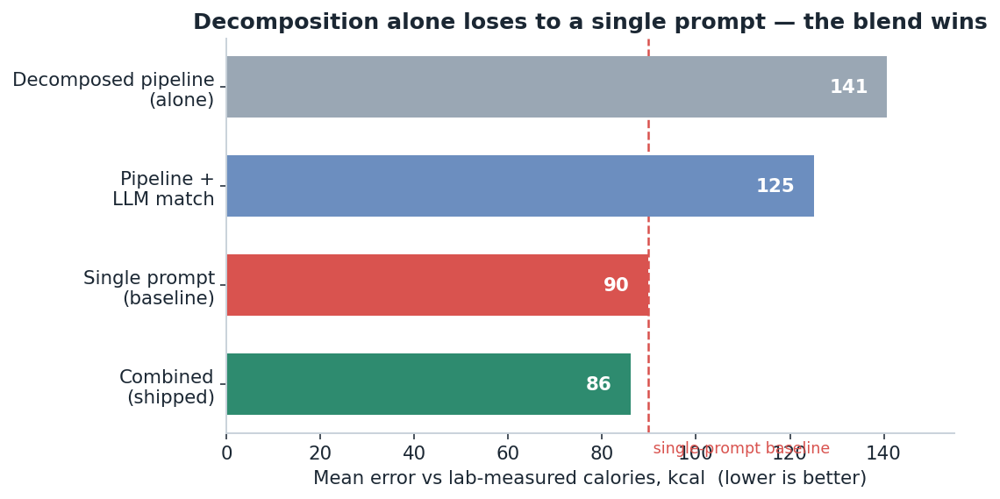
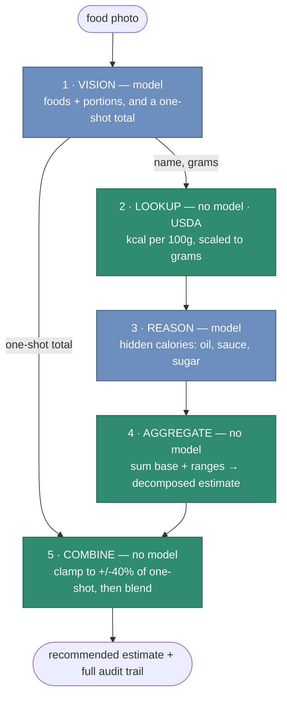
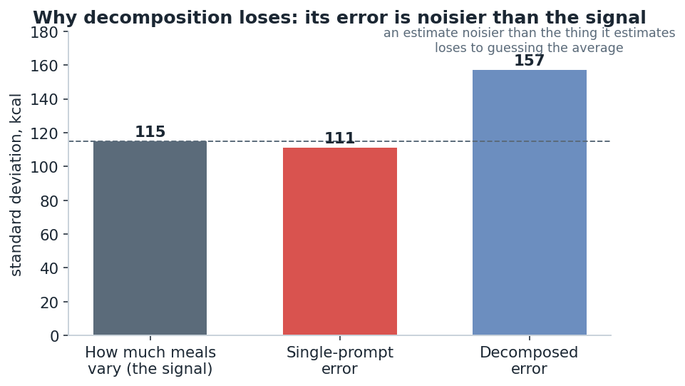

# calorie-pipeline

**A study in decomposition vs. model size — and an honest benchmark that
complicated the answer.**

A multi-stage calorie estimator that runs entirely on local 7B models (via
[Ollama](https://ollama.com)) plus a deterministic nutrition database, built to
test a thesis: that decomposing the problem would beat the **same** model asked to
one-shot a food photo.

Then I benchmarked it against 24 meals with **lab-measured** calories
([Nutrition5k](https://github.com/google-research-datasets/Nutrition5k)). The
result was not what I expected, and the repo reports it straight: on raw accuracy
the one-shot baseline **won** (MAE 90 vs 141 kcal). What the decomposition buys is
not accuracy but **accountability** — auditable reasoning, loud-not-silent
failure, and calibration that doesn't depend on the test set matching a model's
priors. The full story, including the four-version debugging trail and the reason
decomposition structurally loses on an in-distribution benchmark, is in
**[the blog post](blog/decomposition-beats-model-size.md)** and
**[`benchmark/`](benchmark/)**.

Everything runs locally. Target hardware is a single 16 GB GPU (RTX 4080 Super).
Nothing leaves the machine.

<p align="center">
  
</p>

> **The punchline.** A single prompt beats the decomposed pipeline on accuracy.
> But the two make *different* mistakes, so a sanity-bounded **blend of them beats
> the prompt** — at ~1.7× the tokens, and with a full audit trail. That's the
> well-architected result: not decomposition *vs.* prompting, but the
> decomposition as an independent, auditable *correction* to the prompt.

```
$ python -m calorie_pipeline.run meal.jpg

====================================================================
IMAGE: meal.jpg
====================================================================
ONE-SHOT BASELINE (same model, whole job at once)
  ESTIMATE: 540 kcal  (single point, no provenance)
  time: 2.1s

DECOMPOSED PIPELINE
  Grounded ingredients (USDA FoodData Central):
    - grilled chicken breast (150 g) -> 248 kcal  [Chicken, broilers or fryers, breast, grilled]
    - white rice, cooked (200 g)     -> 260 kcal  [Rice, white, long-grain, cooked]
    - broccoli, steamed (90 g)       -> 31 kcal   [Broccoli, cooked, boiled, drained]
  Base (database) total: 538 kcal
  Hidden-calorie adjustments (model judgment, as ranges):
    + cooking oil on broccoli and rice: 60-150 kcal
  ESTIMATE: 598-688 kcal  (midpoint 643)
  time: 5.4s
====================================================================
```

The one-shot model emits a confident single number. The pipeline emits a *range*
you can audit line by line — every calorie traced to a USDA record. It is not
*more accurate* on the benchmark (it isn't), but it is *legible*, it fails loudly
instead of silently, and — combined with the one-shot — it produces the best
answer of all.

---

## The thesis, in one paragraph

Photo calorie estimation looks like one judgment ("how many calories is this?")
but is really three very different problems stacked together: **perception**
(what food, how much), **recall of measured facts** (calories per 100 g), and
**estimation of the invisible** (the oil, butter, and sugar a photo cannot show).
A one-shot model does all three at once, badly, and hands you a single number
with no way to check it. This project pulls them apart, routes each to the tool
that should own it — a model for perception, a *database* for facts, a model for
the invisible, *arithmetic* for the total — and the accuracy follows from the
decomposition. Same model. Different architecture. Better answer.

---

## Architecture

Four inspectable stages — model for judgment, code for facts — plus a final
combine step that corrects the cheap one-shot with the decomposition.



<sub>**Blue** = a model makes a judgment · **green** = deterministic code does
facts/math. Two of the four pipeline stages — and the combine — use no model at
all.</sub>

Each arrow is a **typed dataclass contract** (`Ingredient` ->
`GroundedIngredient` -> `Adjustment` -> `Estimate`), so any boundary in the
pipeline can be printed, serialized, asserted on, or swapped without reaching
inside the stages on either side. Two of the four stages use no model at all.

| Stage | File | Model? | Job |
|------|------|:-----:|-----|
| Vision | [vision.py](calorie_pipeline/vision.py) | yes | identify + portion foods, emit JSON, nothing else |
| Lookup | [lookup.py](calorie_pipeline/lookup.py) | **no** | ground each food in USDA energy data, keep the receipt |
| Reason | [reason.py](calorie_pipeline/reason.py) | yes | probe for hidden calories (oil, butter, sugar) as ranges |
| Aggregate | [pipeline.py](calorie_pipeline/pipeline.py) | **no** | sum base + ranges into a low/high/point |

---

## Why the non-AI lookup stage is the key design decision

It is tempting to read "AI calorie estimator" and assume the cleverness lives in
the model. It does not. **The single most important design decision in this
project is the stage that contains no model at all.**

Here is the reasoning. The error in a photo calorie estimate decomposes into
roughly three sources:

1. *What food is this?* — perception. Models are genuinely good at this.
2. *How many calories per 100 g of that food?* — a **measured fact**. This is
   the largest and most avoidable error source when you ask a model, because the
   model is approximating a memorized lookup table and will confidently return
   "chicken breast ≈ 200 kcal/100 g" when the measured value is 165.
3. *How much hidden oil/butter/sugar is here?* — genuinely unobservable; a real
   estimate under uncertainty.

A one-shot model conflates all three and bakes (2) — the part with a *correct
answer that exists in a database* — into a number you cannot inspect. The
decomposition takes (2) off the model's plate entirely and resolves it against
[USDA FoodData Central](https://fdc.nal.usda.gov/), a curated, lab-measured
nutrient database. The model **cannot get the per-100 g energy wrong, because it
never produces it.** And because we keep the matched USDA description and FDC ID
in the output (`GroundedIngredient.fdc_description`), every base calorie is
traceable to a specific, citable record.

> The hard part of trustworthy AI is rarely "make the model smarter." It is
> "stop asking the model the questions that already have answers."

This is also why the lookup deliberately handles **both** FDC nutrient schemas —
the flat `nutrientNumber` field and the newer nested `nutrient.number` field —
since FDC has been migrating between them and search results mix the two. A fact
source is only as good as your ability to read it robustly. See
[`extract_energy_kcal`](calorie_pipeline/lookup.py).

And "use a database" turned out to hide a second judgment call: *which* database.
FDC's **Foundation** set is the highest quality — curated, lab-measured — but its
coverage is thin. Run real meal ingredients against Foundation alone and it
grounds about **1 in 7**, returning dangerous near-matches for the rest
(`fresh basil → "Corn, sweet…"`, `plain bagel → "Yogurt, plain, nonfat"`). So the
lookup walks an ordered fallback — **Foundation → SR Legacy → FNDDS** — preferring
measured data when it exists and degrading to broader sets when it doesn't, which
takes coverage to ~7/7 with sane matches. The lesson is itself the thesis in
miniature: even the "deterministic" stage required engineering judgment, and even
your ground-truth source has gaps you must design around rather than wish away.

---

## Why local 7B is the point, not a limitation

The instinct on seeing wobbly local-model output is to reach for a bigger model
or a frontier API. This project argues the opposite: **constraining yourself to a
local 7B is what forces the good architecture.**

- **A bigger model hides the lesson.** Give GPT-4o the one-shot prompt and it
  will paper over the missing structure with sheer capability — and you will
  learn nothing about *why* it works or where it fails. Hold the model fixed at
  7B and the only variable left is architecture, so the benchmark below isolates
  exactly what decomposition does and doesn't buy you (it turned out to be a
  bias-for-variance trade, not a free accuracy win — see the results).
- **The structure is what transfers.** Drop a frontier model into stage 1 and 3
  and the same pipeline gets better, not obsolete. Decomposition and raw model
  power are complements, not substitutes. The architecture is the durable asset.
- **Local is a real constraint with real benefits.** It runs on one 16 GB GPU,
  costs nothing per call, has no rate limit, and never sends a photo of your
  dinner to a third party. For a problem people run dozens of times a day on
  personal data, "private, free, and on your own hardware" is a feature.

Config is centralized in [`config.py`](calorie_pipeline/config.py) and every knob
is env-overridable, so a bigger box swaps in larger models with **zero code
changes**:

```bash
VISION_MODEL=llama3.2-vision:90b TEXT_MODEL=qwen2.5:72b \
  python -m calorie_pipeline.run meal.jpg
```

---

## Does it actually work? The benchmark (and its honest answer)

The claim is measured, not asserted — and the measurement is the most interesting
part of the project. [`benchmark/`](benchmark/) scores both methods on **24 real
meals with lab-measured calories** from
**[Nutrition5k](https://github.com/google-research-datasets/Nutrition5k)** (Thames
et al., CVPR 2021), the right yardstick because its ground truth is *measured, not
modeled*.

```
                          one-shot     pipeline
  MAE (kcal)                  90          141
  MAPE                        33%          48%
  dishes won (closer)         16            8
  interval coverage            0%           0%
```

**The one-shot baseline won on accuracy.** Decomposition did *not* beat model
size here — and the autopsy is the payoff:

- **Portioning was fine** (pipeline grams were 1.03× truth on average); the
  systematic error was **database matching** (foods grounded ~22% too
  calorie-dense). The "trivial" no-model stage held all the bias.
- **Errors compound.** `kcal = density × grams` is a product, so per-stage errors
  *multiply* — the pipeline is high-variance and occasionally blows up (a 512-kcal
  plate became 1,344). The one-shot makes one guess regularized toward a sensible
  prior, so it's biased but low-variance — and low variance wins on an
  in-distribution benchmark clustered near 350 kcal.

<p align="center">
  
</p>

- **The fancy fix backfired.** Swapping keyword matching for semantic embeddings
  improved every example I hand-checked but made *aggregate* error worse (MAE
  141 → 188). Boring guards (don't match "salmon" to "Fish oil") beat the
  sophisticated re-ranker. (Semantic matching ships off by default; `SEMANTIC_MATCH=1`.)

### …but a well-architected solution *does* beat the prompt — by blending

Decomposition alone loses, but it makes *different* mistakes than the one-shot
(their errors correlate only r=0.29). So the winning move isn't pipeline-vs-prompt
— it's **both**, blended:

```
  method                                 MAE      vs one-shot
  single prompt (one-shot)               90       baseline
  pipeline (keyword match, default)      141       loses
  pipeline (LLM picks the USDA match)    125       loses
  blend: one-shot + LLM-match pipeline    87       BEATS
```

<p align="center">
  
</p>

Two ideas got there. First, **let the model pick the database match** (a judgment:
"is 'salmon fillet' the raw fish, the nuggets, or the oil?") instead of keyword/
embedding heuristics — `LLM_MATCH=1`, and it only *selects* a real row so it can't
invent calories (141 → 125). Second, **combine the decomposed estimate with the
one-shot**: clamp the pipeline to within ±40% of the one-shot (the cheap estimate
as a sanity bound that caps the pipeline's occasional blow-ups), then blend. The
decomposition becomes an independent, auditable *correction* to the prompt's
regress-to-the-prior bias, and the result beats either alone (**86 vs 90**). The
`compare()` API returns this as `combined_kcal`, the recommended answer.

> Honest sizing: the blend's MAE win is ~3% and its median is slightly worse — the
> gain is robustness against the one-shot's big misses. The per-dish oracle scores
> 54, so a confidence-aware combiner has far more to give. And the decomposition's
> *other* edge is qualitative — on real-world photos the one-shot returned **0**
> for a bagel stack while the pipeline returned an auditable 530.

### "But it uses more tokens"

Measured, not hand-waved (`python benchmark/measure_tokens.py`):

```
  single prompt                       1.00x   (the image is ~1,100 tok; text is rounding error)
  decomposed pipeline                 1.66x
  combined, naive (2 image encodes)   2.66x   <- the fair version of the critique
  combined, FUSED (1 image encode)    1.71x   <- shipped (pipeline.estimate_fused)
  USDA grounding (the accuracy)       free    (an HTTP lookup, not a model)
```

A single vision call returns **both** the one-shot total and the breakdown
([`estimate_fused`](calorie_pipeline/pipeline.py)), so you encode the expensive
image once, not twice — the combined, auditable answer costs ~1.7× a single
prompt, and the stage that *drives the accuracy is free*.

<p align="center">
  
</p>

Full analysis and the four-version debugging trail:
**[the blog post](blog/decomposition-beats-model-size.md)** ·
[`benchmark/results/summary.md`](benchmark/results/summary.md).

### Reproduce it

```bash
# the headline benchmark (downloads Nutrition5k images, runs both methods, scores)
python benchmark/build_manifest.py 24
OLLAMA_HOST=http://tower.local:11434 TEXT_MODEL=qwen2.5:7b-instruct \
  FDC_API_KEY=... python benchmark/run_benchmark.py
```

Results (per-dish table, aggregate scores, predicted-vs-measured chart) land in
[`benchmark/results/`](benchmark/results/). See [`benchmark/README.md`](benchmark/README.md)
for methodology.

### Offline harness (deterministic, no model or network)

[`evals/`](evals/) also ships a fixture-based harness that proves the metrics and
aggregation math with **zero dependencies** — useful for CI and for understanding
the scoring, though its hand-authored fixtures show the *idealized* case, not the
messier live result above:

```bash
python -m evals.harness                                # deterministic fixtures
python -m evals.harness --manifest evals/manifest.sample.json   # your own photos
```

### Where the pipeline does shine: real-world photos

The benchmark is in-distribution cafeteria food shot top-down — exactly where the
one-shot's "guess the average meal" prior is strongest. On three ordinary
real-world photos (angled, with scale cues), against published calories:

```
                truth    one-shot          decomposed pipeline (audit trail)
pizza slice      310     250               305-315   crust 140 + mozz 60 + sauce 10 + pepperoni 76
turkey club      450     450  (exact)       581       bread 411 + turkey 82 + cheddar 82 + veg
bagel stack      500       0  (FAILED)      530       bagel 417 + sesame 113
```

The honest read: the pipeline is *exact* on the pizza and gives a defensible 530
on the bagels where the **one-shot fell off a cliff and returned 0**; the one-shot
nails the sandwich (its mean-regression happens to land), where the pipeline is
high because vision guessed 150 g of bread — a miss you can *see and override* in
the audit trail. The pipeline's edge here isn't lower error, it's that it fails
loudly, shows its work, and doesn't depend on the photo matching a model's prior.

> Getting even this far was not free. The first live run was *much* worse: vision
> emitted a single "pepperoni pizza slice" blob, the lookup matched it to pure
> pepperoni meat (756 kcal), and "sandwich" resolved to **"Ice cream sandwich."**
> Forcing real decomposition and adding the relevance-guarded, pooled USDA match
> fixed those — the "deterministic" lookup needed the most engineering of any
> stage. The full four-version debugging trail is in the
> [blog post](blog/decomposition-beats-model-size.md).

---

## Install & run

```bash
git clone <this-repo> && cd calorie-pipeline
pip install -r requirements.txt          # ollama, requests
cp .env.example .env                     # all defaults work as-is

# pull the local models (once), on whatever box runs Ollama
ollama pull qwen2.5vl:7b
ollama pull qwen2.5:7b

python -m calorie_pipeline.run path/to/meal.jpg
python -m calorie_pipeline.run path/to/meal.jpg --json   # full Comparison as JSON
```

No API key is required to start: `FDC_API_KEY` defaults to `DEMO_KEY`
(rate-limited). A free, instant upgrade key is at
<https://fdc.nal.usda.gov/api-key-signup>.

---

## Project layout

```
calorie_pipeline/
  config.py      centralized, env-overridable Config (models, FDC, Ollama host)
  models.py      typed dataclass contracts: Ingredient -> ... -> Estimate
  vision.py      stage 1 — photo -> portioned ingredients   (model)
  lookup.py      stage 2 — USDA FDC grounding, dual schema  (no model)
  reason.py      stage 3 — hidden-calorie probe, as ranges  (model)
  pipeline.py    stage 4 + orchestration + one-shot baseline + compare
  run.py         the side-by-side, timed CLI
evals/
  datasets.py    Nutrition5k CSV loader + JSON manifest loader
  metrics.py     point (MAE/MAPE/bias) + interval (coverage/width) metrics
  fixtures.py    deterministic offline stage outputs (the always-runnable proof)
  harness.py     score one-shot vs pipeline; offline default, live opt-in
benchmark/
  build_manifest.py  select + download Nutrition5k dishes -> manifest.json
  run_benchmark.py   run both methods on every dish, score, chart (the headline)
  results/           per-dish table, scores, predicted-vs-measured chart
tests/           59 stdlib unittests; no model/network needed
```

---

## Design notes

- **Typed contracts, not loose dicts.** The value of this system lives in the
  *interfaces between stages*. Frozen, slotted dataclasses make those interfaces
  explicit and checkable. A dict says "trust me"; a typed contract says "here is
  exactly what crosses this boundary."
- **The model decides; Python executes.** Stages 1 and 3 make judgments. Stages
  2 and 4 are deterministic. If a rule could decide it, a model shouldn't.
- **Misses are data, not failures.** No USDA match → `kcal = None`, surfaced in
  the output, excluded from the base — never silently guessed. A network error
  in lookup degrades one ingredient to "unmatched," it does not crash the run.
- **Honest output.** The final estimate is always a range. The midpoint is a
  convenience, never a claim of precision.
- **Pure functions at every seam.** Parsing, energy extraction, aggregation, and
  rendering are all pure and unit-tested without a live model or network — which
  is why `python -m unittest discover -s tests` runs in well under a second.

```bash
python -m unittest discover -s tests   # 42 tests, offline
```

---

## The transferable principles

The food is incidental. What the benchmark actually taught, in order of how much
it cost me to learn it:

1. **Build the eval that can falsify you, then publish what it says.** This repo's
   benchmark refuted its own thesis. That's the project working, not failing — and
   it's the difference between an engineer and an enthusiast.
2. **The boring stages hold the error.** All the systematic bias lived in the
   "trivial" database lookup, not the AI stages I lavished design on. Audit the
   part you assume is easy.
3. **Sophistication is a liability until a benchmark says otherwise.** Semantic
   embeddings improved every example I eyeballed and made the *aggregate* worse.
   Measure on the distribution; never ship what only looked good on spot-checks.
4. **Decomposition trades bias for variance.** A pipeline of well-calibrated
   stages is unbiased but high-variance (errors compound multiplicatively); a
   monolith is biased toward its prior but low-variance. Neither is "better" —
   know which trade fits whether your inputs resemble your test set.

And the reframed thesis, the one the data supports:

> **Decompose an unverifiable judgment into verifiable subproblems, spend a model
> only where judgment is required — not because it's more *accurate*, but because
> it's more *accountable*: legible, loud-failing, and calibrated by facts rather
> than by a lucky match to a model's priors.**

## License

MIT — see [LICENSE](LICENSE).

Nutrition5k is © its authors, released under CC BY 4.0. USDA FoodData Central is
a public-domain U.S. government dataset.
