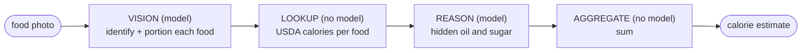

# calorie-pipeline

Can a local 12B vision model estimate the calories in a meal from a photo? Asked
directly, no. Wrapped in a small workflow that grounds the facts in a database,
yes. Same model, 64 percent less error, measured against lab truth.


The model sees the food perfectly and guesses its calories terribly, because the
calorie number is a fact it half-remembers, not something it can read off the
image. So the workflow lets the model do what it is good at (identify and portion
the food) and hands the part it is bad at (the calorie lookup) to USDA FoodData
Central. The model never produces a calorie number.

Full write-up, the worked example, and how it is measured:
**[the article](blog/how-to-beat-a-single-prompt.md)**.

## The result

Across 24 lab-measured Nutrition5k dishes, on gemma4:12b:

| approach | mean error |
|---|--:|
| one-shot (ask the model) | 504 kcal |
| **workflow (grounded)** | **181 kcal** |


## How it works

Four stages with typed contracts between them. Two of the four use no model.



The repo also ships a comparison harness: nine swappable methods (one-shot,
chain-of-thought, few-shot, self-consistency, self-refine, grounding, blends) each
a small class in [`calorie_pipeline/methods.py`](calorie_pipeline/methods.py), run
across model sizes and ranked with significance tests. Adding one is a class and a
line in the registry.

## Reproduce

```bash
pip install -r requirements.txt
ollama pull qwen2.5vl:7b && ollama pull qwen2.5:7b
export OLLAMA_HOST=http://localhost:11434 FDC_API_KEY=DEMO_KEY   # DEMO_KEY works

python -m calorie_pipeline.run meal.jpg        # one photo, one-shot vs workflow
python benchmark/compare_methods.py            # the full benchmark
python -m unittest discover -s tests           # 63 offline tests
```

Vision and text models are env-overridable (`VISION_MODEL`, `TEXT_MODEL`), so the
12B-vs-7B comparison is one variable, no code change.

## Layout

```
calorie_pipeline/   the staged estimator + methods.py (the survey)
benchmark/          Nutrition5k builder, comparison harness, results/
docs/               the charts and figures
blog/               the write-up
tests/              63 offline tests, no model or network
```

## License

MIT. Nutrition5k is CC BY 4.0; USDA FoodData Central is public domain.
