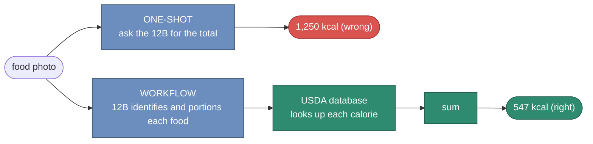
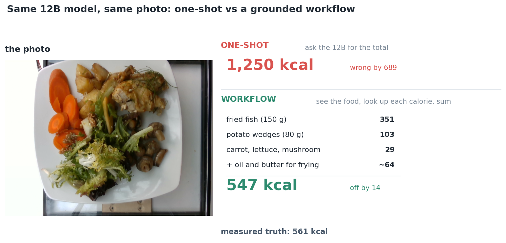
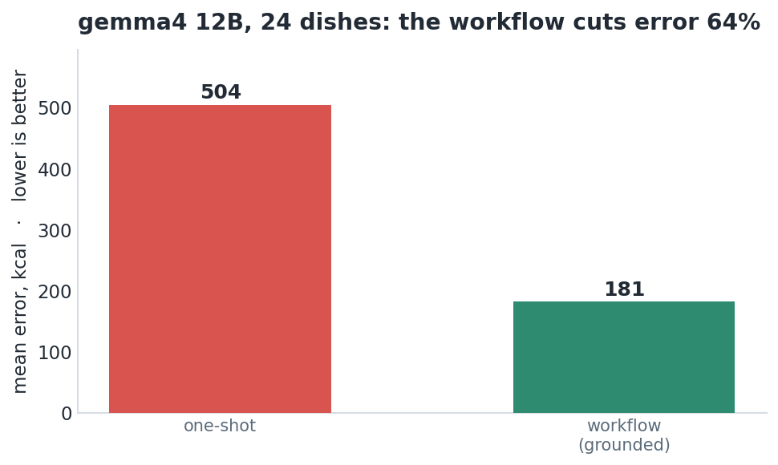

# A 12B model can see your food. It cannot count the calories.

### So I stopped one-shotting it. The same model, wrapped in a small workflow, goes from useless to within 14 calories of the truth. A measured case for workflows over raw prompting on local models.

The goal is one question: can a local 12-billion-parameter vision model estimate
the calories in a meal from a photo? I scored it against Nutrition5k, a dataset of
real plated meals whose calories were measured in a lab, so every answer has a real
number to check against. Everything runs on one GPU, nothing leaves the machine. I
tried the obvious way first, then a better way.

## The obvious way: ask the model

Show gemma4:12b a photo and ask for the total. It answers instantly, one number, no
reasoning, no provenance. The number is bad. Across 24 dishes its mean error was
504 calories, and it tends to guess somewhere between 700 and 1,250 almost
regardless of what is on the plate.

The model is not blind. Ask it to describe the same photo and it is perfect:
"roasted fish, potato wedges, carrots, a side salad." It sees the food fine. It
just cannot turn what it sees into a calorie number, because that number is a fact
it half-remembers, not something it can read off the image.

## The better way: a workflow

So I stopped asking the model to do the part it is bad at. The workflow splits the
job along that exact seam.



The model does what it is good at: naming and portioning the food. A database does
what it is good at: the calorie lookup. Code adds it up. The model never produces a
calorie number at all.

Here is one real dish, both ways:



One-shot says 1,250. The workflow identifies the food, grounds each item in USDA
FoodData Central, sums it, and lands at 547. The measured truth was 561.

## The result

That is not a lucky dish. Across all 24:



One-shot 504, workflow 181. The same model, wrapped correctly, cuts its error by 64
percent.

Every number here is mean absolute error against the lab-measured truth, averaged
over the 24 dishes, and the gap is checked with a paired bootstrap so a win has to
clear the noise rather than just look good on a few photos.

## Why it works

A vision model bundles two very different skills: perception (what is this) and
recall (how many calories is that). It is strong at the first and unreliable at the
second. One-shotting forces it to use both at once, and the weak skill drags the
answer down. The workflow uses only the strong skill and hands the weak one to a
source that is actually reliable.

That is the part worth keeping, and it has nothing to do with food. When a model is
confidently wrong about facts, do not prompt it harder. Find the one step it is bad
at, and give that step to something built for it, a database, a tool, a calculator.
Let the model do judgment, not lookup.

## What it costs

The workflow is not free. It makes two model calls (the model identifies the food,
then a small text model reasons about hidden oil and sugar) where the one-shot
makes one. On a model with clean token accounting that ran about 1.7x the tokens of
a single prompt. The USDA lookup that drives the accuracy adds nothing, because it
is an HTTP request to a database, not a generation.

But the same split that adds a call is what keeps the pipeline cheap. Because the
stages are separate, you size each one on its own. The lookup needs no model. The
reasoning is text only, so it runs on a small fast text model, not the vision one.
You pay for the heavy vision model on the single step that actually needs to see,
and nowhere else. That is how a pipeline of small local models comes out quicker
and cheaper than one-shotting one large model for everything, and you can swap any
stage's model with one environment variable, no code change. Right-size each step
instead of paying frontier prices to do lookup and arithmetic a database does for
free.

## Where it is rough

Twenty-four dishes is a small benchmark, and I would rather say so. The matching is
the weak link: when USDA has no clean row for the food the model named, that item
falls back to the model's own estimate and the grounding cannot help. And this is
one task, calories, where the facts happen to live in a clean public database. Not
every problem has a USDA.

## Reproduce

The estimator and every method are in the repo. The workflow is four stages with
typed contracts: vision identifies and portions, USDA supplies the calories, a
small model probes for hidden oil and sugar, arithmetic sums it.

```bash
python -m calorie_pipeline.run meal.jpg        # one photo, one-shot vs workflow
python benchmark/compare_methods.py            # the full benchmark across methods
python -m unittest discover -s tests           # 63 offline tests
```

Runs local on a 16 GB GPU. Ground truth is Nutrition5k (CC BY 4.0); facts are USDA
FoodData Central. MIT.
