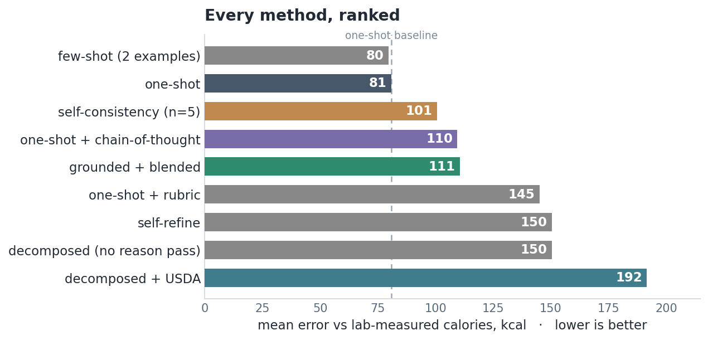
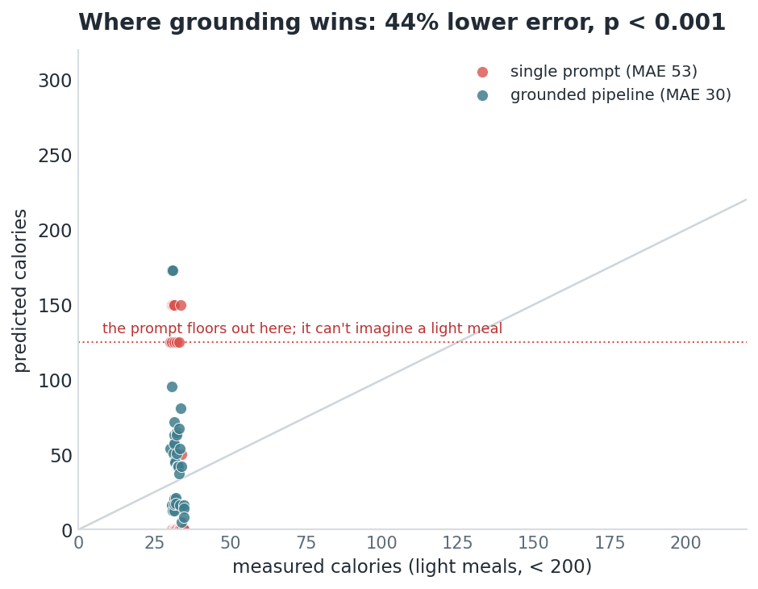

# Capability is not the lever

### A newer, bigger model did this task six times worse than a smaller one. I ran nine methods across two model sizes against lab-measured truth. The only thing that moved accuracy was grounding the model's specific weakness, not scaling up and not fancier prompting.

Here is the experiment that changed how I pick an approach. The task is estimating
calories from a food photo, scored against physically measured ground truth from
Nutrition5k. Everything runs locally. I wanted one question answered honestly: when
you have a single prompt that works, what actually makes it better?

I tested the two things everyone reaches for. A pile of prompting techniques, and a
bigger model. Both lost.

## Fancier prompting lost

I built nine estimators on a 7B vision model, each a clean swappable method, and
ranked them on the same 24 dishes.



| method | error (kcal) | cost (tokens) |
|---|--:|--:|
| few-shot | 80 | 3,511 |
| **one-shot** | **81** | **1,092** |
| self-consistency | 101 | 5,460 |
| chain-of-thought | 110 | 1,224 |
| grounded + blended | 111 | 1,927 |
| one-shot + rubric | 145 | 1,157 |
| self-refine | 150 | 2,206 |
| decomposed, no reasoning | 150 | 1,507 |
| decomposed + USDA | 192 | 1,923 |

The plain one-shot is the cheapest method and tied for the most accurate. Chain of
thought, self-consistency, a domain rubric, self-critique, grounding: every one of
them landed worse, several significantly so on a paired bootstrap. The thing I was
most sure about, grounding the food in a database, came in last.

Each of those techniques fixes a real failure. Chain of thought helps when the
model skips reasoning. Sampling and voting helps when it is high variance.
Grounding helps when it is guessing facts. On this task the 7B does not have most
of those failures, so the techniques do not remove an error, they add one. More
steps mean more places for a small model to go wrong.

## A bigger model lost harder

So I did the obvious thing and swapped the 7B for a newer 12B. I expected a bump.

The one-shot got six times worse. Mean error went from 81 to 504. The 12B
identifies food perfectly well, it described every dish correctly, but it guesses
around 700 calories for almost everything regardless of what is on the plate. More
parameters, a worse answer.

That is the whole point in one data point. Capability is not a dial you turn for
accuracy. A bigger or newer model is a different set of strengths and weaknesses,
not a strictly better one, and you do not find out which until you measure on your
task.

## What actually helped: grounding the specific weakness

Average error hides the cases that matter. A model's prior is fine in the middle of
its range and wrong at the edges, so I stopped averaging and looked at where each
model is actually weak.

On the 7B, the weakness is light meals. Its calorie prior has no concept of a small
plate, so on dishes under 200 calories its entire output vocabulary is
`0, 15, 50, 125, 150`. It cannot produce a small number. Grounding has no prior, it
counts what is on the plate, and there it cuts error by 44 percent, from 53 to 30,
with p below 0.001.



On the 12B, the weakness is the arithmetic itself. It sees the food fine and then
fabricates the calorie number. So grounding, which takes the number away from the
model and hands it to a database, should rescue the bigger model the same way.

<!-- gemma 12B grounded vs one-shot result + two-model chart: completed when the survey lands -->

Same workflow, opposite verdict on the two models, for the same reason. Grounding
is the worst method on the 7B and the best on the 12B, because it helps exactly
where the base model is weak and hurts where it is not.

## The takeaway

Stop reaching for scale or for whatever technique is trending. Neither is the
lever. The lever is fit: find the specific thing your model is bad at, and add the
one piece of structure that offloads exactly that, ground facts it fabricates,
constrain numbers it cannot produce, and leave alone the parts it already does
well. A 7B that you wrap correctly beats a 12B that you one-shot, and beats the 7B
that you over-engineer.

Diagnose first. Then add nothing you cannot point at a failure for.

## Reproduce

Every method is a small class in `calorie_pipeline/methods.py`. The benchmark runs
them all across model sizes and ranks them with significance tests.

```bash
python benchmark/compare_methods.py            # the survey + leaderboard
VISION_MODEL=gemma4:12b python benchmark/compare_methods.py   # same survey, bigger model
python -m unittest discover -s tests           # 63 offline tests
```

Runs local on a 16 GB GPU. Truth is Nutrition5k (CC BY 4.0); facts are USDA
FoodData Central. MIT.
